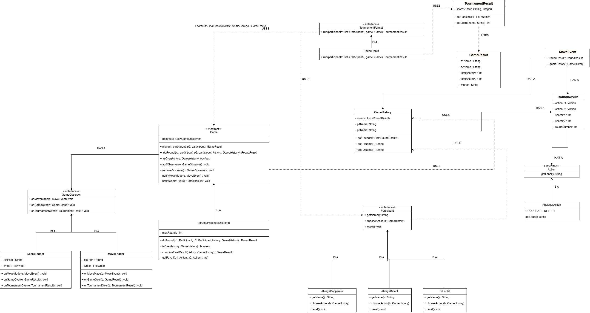

# Sprint1_Meier

<h2>//My current TODO</h2>

Finsh:

[ ] Abstract Game

[ ] Itterated Prisoners Delima Extension

[ ] Tournament result

[ ] Round Robin

[ ] TitForTat

[ ] getLastRound() method likely in gameHistory

[ ] testing

